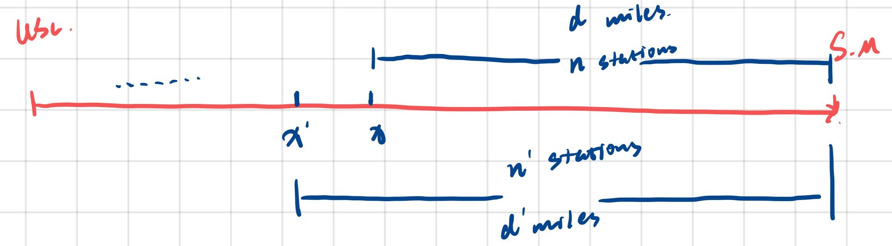
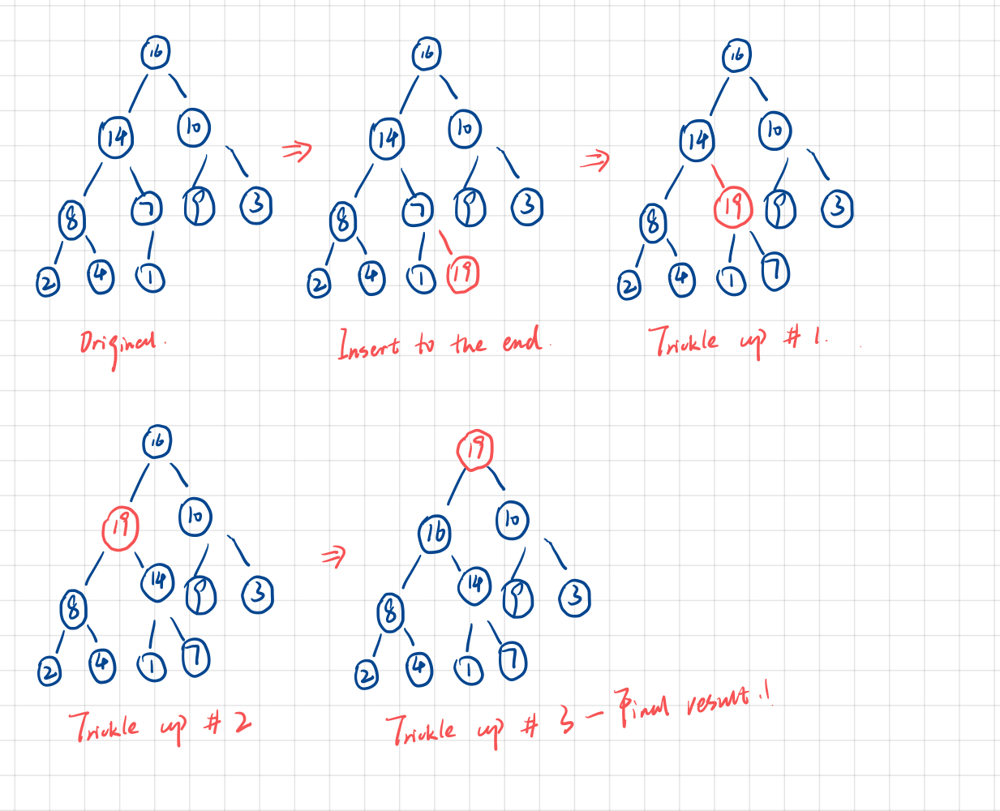

# CSCI 570 - Homework 03

- **Author:** Boyang Xiao
- **Due Date:** Sep. 14th 2022
- **USC id**: 3326-7302-74
- **Email**: <a href="mailto:boyangxi@usc.edu">boyangxi@usc.edu</a>

---

### Problem 1

#### Answer:

1. We sort all ropes from the shortest to the longest.
2. We pick up the first two **shortest** ropes to connect them together.
3. We pick up the **shortest** one from the **remainings** till we connect all the ropes.

---

### Problem 2

#### Answer:

- ##### Algorithms:
  - We sort all the tasks in the descending order of the time of $b_i$(the second part).
  - We arrange the the task with largest $b_i$ first and smallest $b_i$ last.
- ##### Proof:
  - First of all, since the computer A can only handle one task at a time, it makes no difference how we arrange the order of the first part of these tasks. So I am gonna prove why we arrange the second part of the tasks like these:
  - Suppose there is a way of arrangement where there are two tasks $(a_i,b_i)$ and $(a_j,b_j)$, and $b_i<b_j$. But in this arrangement, task i is arranged ahead of task j.
  - Since task i is arranged ahead of task j, the total time for computer B to finish these two tasks $time_b$ can be calculated as below. To note that $b_i$ must be started ahead of $b_j$ and their duration can have overlaps. $$max(b_i, b_j) <= time_b< (b_i+b_j)$$
  - However, in our optimal arrangement, task i is arranged ahead of task j, and the $time_b$ can be calculated by: $$time_b = max(b_i, b_j)$$
  - As we can see, when the time to finish all the first parts of tasks remain the same, arranging the second part of longest time first can obtain a minimized total time.

---

### Problem 3

#### Answer:

- ##### Algorithms:
  - Everytime we arrive at a gas station, we check the remaining milage that we can cover and compare it with the distance to the next gas station/Santa Monica(if there is no gas station left ahead).
  - If we can't make it to the next station, we stop at this gas station and fill up the tank.
  - Else, we pass by this gas station and repeat the loop at the next station.

- ##### Proof:
  - Assume that in the algorithms we come up with above, there is one station along the route that we should stop by and there are still $n$ stations behind this specific station that we should stop by and $d$ miles we have to cover, as shown in the Figure below.
  - Suppose that at the one gas station $x'$ before this station $x$, the remaining milage $p'$ is greater than the distance to the station $x$, but we still stop at this station and fill up the tank.
  - Then, after we stop by at the station x', the distance $d'$ we have to cover must be greater than $d$ we mentioned above, which means that the numbers $n'$ of stations we have to stop by must also be grrater than or equal to $n$.
  - Therefore, if we don't follow the algorithms we come up with above, the total number of stations we have to stop by can only be greater (or the same at least). So our algorithm is the optimal

- ##### Runtime complexity: $O(logn)$

---

### Problem 4

#### Answer:

**(a)** First, we divide the whole cents with 25 cents and get how many quarter coins we can use. Then, we divide the remainings with 10 cents to see how many dimes we can use. Then, we divide the remainings with 5 cents to see how many nickle coins we can use. Last, the remaining cents are the number of 1 cent coins.

**(b)** I don't believe that in this coin system, there are counter examples where the greedy algorithm cannot work, because all the coins' denominations can be divided by each other. But let's take a look into the coins denominations consist of $(4,3,1)$. Then for 6 cents, Greedy can yeild the results of $(4,1,1)$ but the optimal results is $(3,3)$.

---

### Problem 5

#### Answer:

- ##### Algorithm:

We sort both set A and set B in their descending orders and the payoff should be maximized.

- ##### Proof:

Suppose there are two pairs in respectively set A and set B: $(a_i, a_j), (b_i, b_j)$, where: $a_i> a_j$ and $b_i> b_j$. In the algorithms above, we should pair$a_i$ with $b_i$ and $a_j$ with $b_j$.

If we change the order and pair$a_i$ with $b_j$ and $a_j$ with $b_i$. It will be easy to prove that:

$${a_i}^{b_i} + {a_j}^{b_j} > {a_i}^{b_j} + {a_j}^{b_i} $$

Therefore, pairing larger a_i with larger b_i can obtain the maximized payoff. Q.E.D.

- ##### Runtime complexity: $O(nlogn)$

---

### Problem 6

#### Answer:

- ##### Algorithm:

  - First, we construct a **min heap** consisting of n nodes. And we push the first items from each students list into this heap.
  - We extract the root node(min item) from the min heap, push it into the output list, and add the next student into the min heap from the list where the extracted student comes from.
  - If some student lists have been empty, we just skip the "adding-to-heap" step and extract the root node directly and repeat.
  - We repeat the above Step2 and Step3 until all the students are pushed into the output list. The output list then should be our final result.

- ##### Runtime complexity: $O(mlogn)$
  - Everytime we add a student into the min heap, it will take $O(logn)$ to sort the min heap, because the min heap have n nodes (or less).
  - We should repeat this sorting step for m times because there are m students in total.
  - These all make a $O(mlogn)$ runtime complexity.

---

### Problem 7

#### Answer:

The inserting process is shown below:

So the final result array should be:

**{19, 16, 10, 8, 14, 9, 3, 2, 4,1,7}**