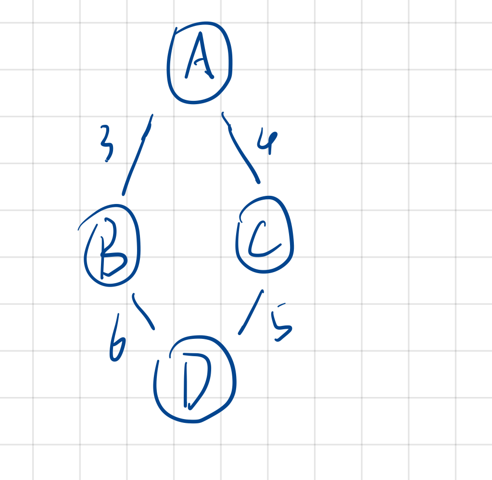
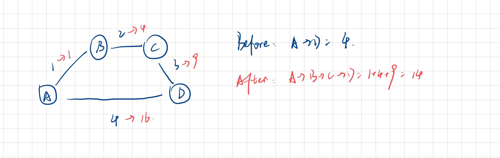

# CSCI 570 - Homework 04

- **Author:** Boyang Xiao
- **Due Date:** Sep. 21<sup>th</sup> 2022
- **USC id**: 3326-7302-74
- **Email**: <a href="mailto:boyangxi@usc.edu">boyangxi@usc.edu</a>

---

### Problem 1

#### Answer:

- #### My data structure designing:

My data structure, lets call it Median Heap, is a binary tree very similar to the max heap or the min heap. The median heap has a root node, which should always saves the median value. And the root nodes has two childen, who are the roots for their own sub-trees. The left sub-tree should be a max heap and the right sub-tree should be a min heap. And the size of them should be the same or at most 1 items greater than the other one. The left subtree's nodes should all have smaller values than the whole root node, and the right subtree's nodes should all have larger or equal values than the whole root node. In this way, to get the median value, we can simply extract the root node's value or extract the mean of the root node and one of its child node. Also, the insertion operation should only go down to the level of the tree, which takes $O(logn)$.

- #### Methods of the Median heap:

```python
MedianHeap::Find-Median(){
    if(sizeof left_tree == sizeof right_tree)
        return rootNode.val;
    else if(sizeof left_tree > sizeof right_tree)
        return (left_tree_root.val + root.val) / 2;
    else if(sizeof left_tree < sizeof right_tree)
        return (right_tree_root.val + root.val) / 2;
}
```

```cpp
MedianHeap::Insert(HeapNode root, float new_val){
    // We use recursion to insert the item recursively to the whole heap
    if(new_val < root.val)
        Push new_val to the end of the left tree
        Trickle it up to make the left tree to be a max Heap
        sizeof left_tree ++;
    else if(new_val >= root.val)
        Push new_val to the end of the right tree
        Trickle it up to make the right tree to be min heap
        sizeof right_tree ++;
    
    if(diff(sizeof left_tree, sizeof right tree) > 1)
        Move the root from the larger side to the smaller side's root;
        Adjust the left and right sub-trees to be a max/min heap;
}
```
---

### Problem 2

#### Answers:

Step 1: Use BFS/DFS to generate a spanning tree ($O(n)$)

Step 2: Loop on the rest edges that are not in the spanning tree:

- Find the cycle formed with the edges in the spanning tree and this extra edge;
- If the longest edge in the cycle is greater than this extra edge, replace this longest edge with this extra edge
- Else, move on to the next edge in the remaining edges list

This algorithm should only go through every edge once and make a $O(n)$ complexity.

---

### Problem 3

#### Answer:

First, remove the removed edge in the given MST, T, if it exsits in T. We check if this is still a spanning tree. If it is not, pick an edge in the new graph $G_1$ to make it a spanning tree again.

Loop on every edge E in the updated graph $G_1$:
- If E already exsists in the spanning tree, jump to the next iteration.
- If E does not exsists in the spanning tree, find the circle formed by the edges in the spanning tree and this edge E. If E is greater than the max edge in the cycle, replace this max edge with E and move on.

---

### Problem 4

#### Answer:

- 1. Answer: c
- 2. Answer: b
- 3. Answer: d

---

### Problem 5

#### Answer:

We modify the Dijakstra algorithm in this way:

In every iteration of the loop, we pick the node with the max bandwidth (cost) and record it in the table.

THen we find the next max bandwidth edge in the graph and compare it with the max node recorded. If the new edge is smaller, we replace the max bandwidth with this new edge and record this new node. If the new edge is larger, we only recorded this new node with the last max bandwidth.

---

### Problem 6

#### Answer:


---

### Problem 7

- #### 1. False

A very simple conter-example below. The shortest path from A to D can be A-B-C or A-C-D with all paths unique.



- #### 2. True

If we increase every edge with the same value, the whole order of operating Dijakstra algorithm is totally the same, because all we have to do is to compare each edge and their relationships are still the same. So the shortest path length is still the same but larger but a multiple of k.

- #### 3. False

If all the decreased edges are in the exsisting shortest path, and the exsisting shortest path is still the shortest one after the decreasing, the total cost of the shortest path can be decreased by a multiple of k but not at most k.

- #### 4. False

Here is an conter-example:



---

### Problem 8

#### Answer:

We can run Dijakstra twice: the first time we choose the s as a start point and get the shortest paths from s to all the other nodes m between s and t, denoted as $D(m)$. And the second time, we choose t as a start point and reverse all the edges' direction in the graph, to run Dijakstra again, and we can get all the shortest paths distance between t and other nodes m, denoted as $D'(m)$.

THen we go through every edge on the graph, we find the two vertexes on the edge, $v_1$ and $v_2$. If we set the edge between $v_1$ and $v_2$ to be $0$. Then the shortest path between s and t can be calculated simply as $$min( (D(v_1) + D'(v_2)), (D(v_2) + D'(v_1)) )$$

And all we have to do is to see which edge we choose to set $0$ can minimize this result. That's how this algorithm works.