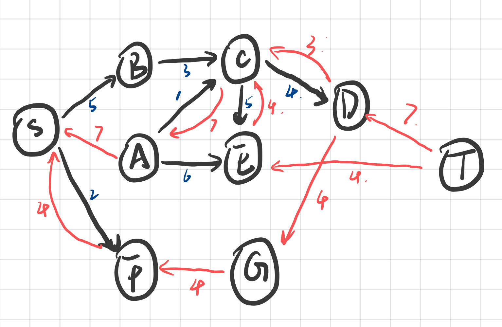

# CSCI 570 - Homework 08

- **Author:** Boyang Xiao
- **Due Date:** Oct. 26th 2022
- **USC id**: 3326-7302-74
- **Email**: <a href="mailto:boyangxi@usc.edu">boyangxi@usc.edu</a>

--- 

## Problem 1

### Answer

(a) The residual graph is shown below:

Where the black edges are forwarding and the orange ones are backwarding

(b) The max-flow value is 3

(c) The min cuts are shown as below:

All the blue dotted lines are ways to get two min cuts of this graph.

---

## Problem 2

### Answer

(a) **False**: If we have a flow whose value is f, then there exsists at least f edge disjoint paths in this graph.

(b) **?**: Didn't figure out

(c) **False**: The sum of multiple flow of edges can be integer.

(d) **False**: The updated max flow of this graph should be $f+n$ where n is the number of edges out of S.

(e) **True**: The relative relations between all edges is remaining the same.

---

## Problem 3

### Answer

First, we get the max flow using Ford-Fulkerson algorithm on the original network. Then we have two choices regrading $k$'s value:

- If $k$ is larger than or equal to the whole number of edges whose flow is $1$ in the network, then we can delete all the edges and the updated value of flow for this network should be $0$.
- If $k$ is smaller than the whole number of edges whose flow is $1$ in the network, then we specify all the edge disjoint paths in this final network. And we delete one edge from each network one by one and we do this in a loop for all the paths, until the deleted edges number reaches $k$. In this way, we can reduce complete paths from this network as many as possible and the whole value of the updated flow should be reduced as much as possible.

---

## Problem 4

### Answer

**(a)** THe flow graph is shown as below:

We can solve this problem as a maximum flow network problem. THe source node is the whole amount of dollars that tourists have, and the sink node is the bank who has the whole amount of the various international currencies. For each tourist, the capacity from S to $t_j$ is $F_j$, and for each edge from $t_j$ to $c_i$, the capacity is $S_{ji}$. And for each $c_i$, the capacity from $c_i$ to the sink node is $B_i$. Then we construct a flow network with a source node and a sink node.

We can then perform Ford-Fulkerson algorithm on this flow network to find the maximum flow for each edge. At the point when Ford-Fulkerson stops the loop, we should have a maximum flow for this network. That is:
- For each tourist, $f(S, t_j) <= F_j$ of his/her dollars are exchanged to the other currancies.
- For each tourist, $f(t_j, c_i) <= S_{ji}$, which means that he/she only gets $f(t_j, c_i)$ of the international currency $c_i$.
- For each currency, the bank has to provide $f(c_i, t) <= B_i$ amount to the tourists.

**(b)** Didn't figure out :(

---

## Problem 5

### Answer

**(a)** We construct a flow network in this way: We create a $S$ node that connects all the starting points in $[a_1, a_2....a_n]$ and a $T$ node that connects all the ending points in $[b_1, b_2,...,b_n]$. The direction should be $S$ to $[a_1, a_2....a_n]$ and $[b_1, b_2,...,b_n]$ to $T$. The other edges' direction should remain the same as in the original graph. And we give all the path with capacity $1$ (unit-capacity).

Then we perform Ford-Fulkerson algorithm on this flow network and get the maximum flow for this network. We check if the value of this flow is $n$, that is, if every edge from $S$ to $[a_1, a_2....a_n]$ has flow value 1 and every edge from $[b_1, b_2,...,b_n]$ to $T$ has flow value 1. If it does, than we can find such disjoint paths, else, we cannot find such paths.

**(b)** Firstly, we construct exactly the same flow network with unit-capacity as we did in problem (a). Then we split every node in this network into two nodes, which are $V_{in}$ and $V_{out}$. We connet every other node that flow into this node to the $V_{in}$ and every other node that flows out from this node to the $V_{out}$. Also, we connect $V_{in}$ to $V_{out}$ with capacity $1$. We split every node like this except for the source node $S$ and the sink node $T$.

Then we can perform Ford-Fulkerson algorithm again on this new network and check if the final flow has a value $n$. If it does, than we find the edge&vertex dijoint paths for this graph, else, we cannot find such paths. 

---

## Problem 6

### Answer

(a) $\Delta = 4$, Augamentation path: $S-A-C-D-T$

The flow after the first iteration: 

THe $G_f(\Delta)$ after the first iteration:

(b) $\Delta = 2$, Augamentation path: $S-F-G-D-C-E-T$

The flow after the second iteration: 

THe $G_f(\Delta)$ after the second iteration:

(c) The scaled version of Ford-Fulkerson algorithm can reduce the iteration number because we start to augment path from the ones with largest bottleneck capacities and this pattern of choice can prevent us from redundant iterations with small capacity edges that lying between other paths.