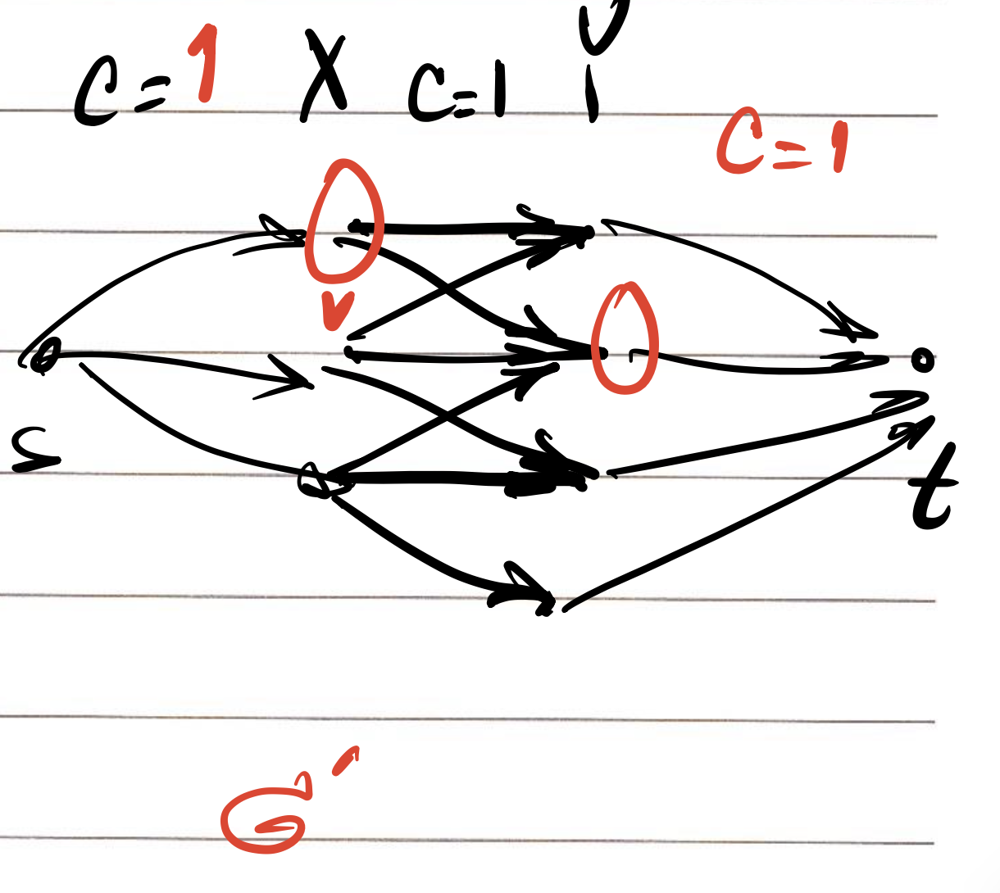

# CSCI 570 - Week 10

## Network Flow *II*

**Lecture date:** Oct. 26th, 2022

---

## Bipartite matching problem

- Bipartite graph definition
- Bipartite matching

### Transfer to a max flow problem

Design a flow network G that has a value of $v(f)= k$ iff there is a matching size of $k$

### Solution

---

## Edge disjoint problem

---

## Circulation network & Lower bound

### Circulation  network defi.

- Is a directed graph
- Has capacity on edge
- Each node has demands:
  - if $d_v > 0$: sink node
  - if $d_v < 0$: source node
  - if $d_v = 0$: neither

- Constraints: 
  - Capacity condition: same as flow network
  - Demand condition: $f_{in}(v) - f_{out}(v) = d_v$

**Fact**: If there is a feasible circulation with demand {$d_v$}, then $\sum d_v = 0$

### Problem: Find a feasible circulation

- Identify all source nodes and all sink nodes
- Create one Super source node $S^*$ and one Super sink node $T^*$
- $S^*$ to {$S$} have capacity of {$d_v$} and {$T$} to $T^*$ have capacity of {$d_v$}
- Run max flow
- Observation of value of flow $v(f)$ and Total demand $D = \sum _{d_v >0} d_v$
  - If $v(f) < D$: No feasible circulation
  - If $v(f) > 0$: Not possible
  - If $v(f) = D$: Found the feasible circulation

### Problem: Feasible circulation with lower bounds

- **Capacity condition: $l_e \leq f(e) \leq c_e$**
- Demand condition: Same

#### Solution

- Step 1: Set for every edge that: $f_0(e) = l_e$, and for every node: $f_0^{in}(v) - f_0^{out}(v) = L_v$
- Step 2: Construct a  circulation network where:
  - For each edge: $c_e' = c_e - l_e$
  - For each node: $d_v' = d_v - L_v$
- Step 3: Find the feasible circulation $f_1$ in this network
- Step 4: Results:
  - If there is no feasible circulation: Then no
  - If there is, then the final circulation should be : $f_0 + f_1$